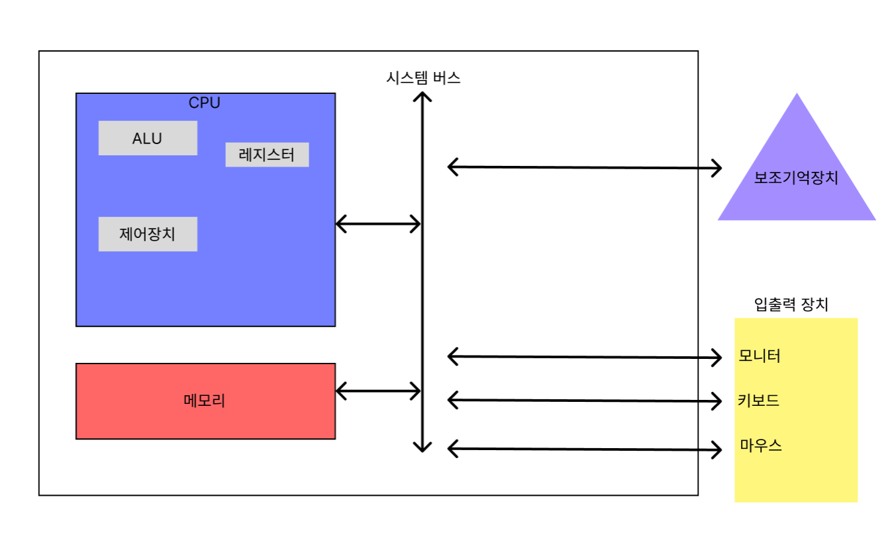

# 컴퓨터 구조

본 포스팅은 한빛미디어의 [혼자 공부하는 컴퓨터 구조+운영체제]를 읽고 개인적으로 학습하여 요약·정리한 내용입니다.

# 컴퓨터 기본 개념 및 동작 원리

### 데이터 : 컴퓨터가 이해하는 숫자, 문자, 이미지, 동영상과 같은 정적인 정보를 가리켜 데이터라고 합니다.

### 명령어 : 데이터를 움직이고 컴퓨터를 작동시키는 정보

# 컴퓨터 핵심 부품 4가지

### 컴퓨터의 구성도 (”혼자 공부하는 컴퓨터 구조+운영체제” 참조)

# CPU : : 명령어 처리 장치

### 구성 요소

- ALU : 컴퓨터 내부에서 계산하는 장치
- 레지스터 : 임시 저장 장치
- 제어장치 : 전기신호를 내보내고 명령어를 해석하는 장치

---

- 메모리 읽기 : CPU가 메모리에 저장된 값을 읽고 싶을 때
- 메모리 쓰기 : CPU가 메모리에 어떤 값을 저장하고 싶을 때

### CPU 실행 과정

메모리 읽기

메모리 쓰기

# 메모리 : : 주기억장치

### → RAM + ROM // 보통 RAM으로 불림.

- 메모리는 데이터와 명령어를 집어넣은 주소공간
- 프로그램이 실행되기 위해서는 반드시 메모리에 저장
- 메모리에 저장된 값의 위치는 주소로 알 수 있음

| RAM | ROM |
| --- | --- |
| 작업대  | 저장소 |
| 휘발성 | 비휘발성 |
| 실행중인 프로그램 | OS, 바이오스 |
| 빠름 | RAM에 비해 느림 |
| 읽기/쓰기 | 주로 읽기 |

# 보조기억장치

### → 하드 디스크, SSD, USB 메모리, DVD, CO-ROM등등

- 컴퓨터 전원이 꺼져도 보관될 프로그램을 저장하는 부품
- 시스템 버스 통로를 이용해 데이터 이동

# 입출력장치 : : 주변장치

### → 마이크, 스피커, 프린터, 마우스, 키보드

- 컴퓨터 외부에 연결되어 컴퓨터 내부와 정보를 교환할 수 있는 부품

# 메인보드 : : 마더보드

- 여러 컴퓨터 부품을 부착할 수 있는 슬롯과 연결 단자
- 메인보드 내부에는 네가지 핵심 부품이 서로 정보를 이동시키는 이동 통로인 시스템 버스가 존재함.
- 시스템 버스는 주소버스, 데이터 버스, 제어버스가 있음.
    - 주소버스 : 읽고자 하는 주소 이동
    - 데이터 버스 : 메모리에 내용 이동
    - 제어 버스 : 메모리쓰기/읽기에 대한 제어신호 이동

# 데이터

### 비트

→ 0과 1을 나타내는 가장 작은 정보 단위

| 1바이트(1byte) | 8비트(8bit) |
| --- | --- |
| 1킬로바이트(1KB) | 1,000바이트(1,000byte) |
| 1메가바이트(1MB) | 1,000킬로바이트(1,000KB) |
| 1기가바이트(1GB) | 1,000메가바이트(1,000MB) |
| 1테라바이트(1TB) | 1,000기가바이트(1,000GB) |

워드 : CPU가 한 번에 처리할 수 있는 데이터 크기

CPUx86 : 32비트 = 1워드

CPUx64 : 64비트 = 1워드

### 이진법

→ 0과 1만으로 모든 숫자를 표현하는 방법

| 십진수 | 이진수 |
| --- | --- |
| 1 | 1 |
| 2 | 10 |
| 3 | 11 |
| 4 | 100 |
| 5 | 101 |
| 6 | 110 |
| 7 | 111 |
| 8 | 1000 |
| 9 | 1001 |

### **이진수 계산법**(뒤에서부터 계산)

예시 : 3 (4비트) 

| 비트 | 0 | 0 | 1 | 1 |
| --- | --- | --- | --- | --- |
| 계산법 | 2^3 x 0 | 2^2 x 0 | 2^1 x 1 | 2^0 x 1 |
| 결과  | 0 | 0 | 2 | 1 |

결과 총합 : 0 + 0 + 2 + 1 = 3

### **2의 보수 :: 이진수의 음수 표현 방법**

계산법 : 해당 숫자의 비트에 모든 0 과 1를 뒤집고, 거기에 1을 더한 값

비트 : 1010 :: 10의 음수

1. 뒤집기 : 0101
2. 더하기 : 0101 + 1 = 0110

### if 만약 양수도 음수도 동일한 비트라면?

비트 : 100 :: 4의 음수

1. 뒤집기 : 011
2. 더하기 : 011 + 1 = 100 → 양수랑 동일한 결과가 나옴

이런 경우 양수 음수 구분을 위해 비트의 맨 첫 번쨰 부분에 양수/음수 추가 정보 비트를 정하는 **플래그**를 사용함.   

### 플래그 이용한 계산법

- 4의 양수 : 0100
- 4의 음수 : 1100

### 십육진법

→ 한글자로 0~9, A~F의 정보 표현

표기법 

1. (16)를 숫자뒤에 작게 표기 
2. 숫자 앞에 0x 표기

예시 

1. 15(16)  
2. 0x15

| 십진수 | 0 | 1 | 2 | 3 | 4 | 5 | 6 | 7 | 8 | 9 | 10 | 11 | 12 | 13 | 14 | 15 | 16 |
| --- | --- | --- | --- | --- | --- | --- | --- | --- | --- | --- | --- | --- | --- | --- | --- | --- | --- |
| 십육진수 | 0 | 1 | 2 | 3 | 4 | 5 | 6 | 7 | 8 | 9 | A | B | C | D | E | F | 10 |

- 십육진수 → 이진수 변환
    - 1A2B(16) → 0001(1) 1010(A) 0010(2) 1011(B)

- 이진수 → 십육진수 변환 (4개씩 끊어서 계산)
    - 0001(1) 1010(A) 0010(2) 1011(B) → 1A2B(16)

### 문자 집합

→ 컴퓨터가 인식하고 표현할 수 있는 문자의 모음

문자 인코딩 : 문자를 0과 1로 변환

문자 디코딩 : 0과 1로 이루어진 문자 코드를 사람이 이해할 수 있는  문자로 변환

### 아스키 코드

→ 문자 집합중에 하나로 영어알파벳, 아라비아 숫자, 일부 특수 문자 포함 

https://namu.wiki/w/%EC%95%84%EC%8A%A4%ED%82%A4%20%EC%BD%94%EB%93%9C 나무위키 참조

### EUC-KR : 한글 인코딩

- 완성형 인코딩 : 초성,중성,종성의 조합으로 이루어진 하나의 글자에 고유한 코드 부여
- 조합형 인코딩 : 초성, 중성, 종성에 비트열을 할당하여 해당하는 비트열을 합쳐서 글자를 만드는 인코딩 방식
- 문제점 : 모든 한글 단어 표현 못함

### CP949 : 마이크로소프트에서 개발한 EUC-KR 확장 버전

- 문제점 : EUC-KR보다 많지만 이것도 모든 한글 글자 표현하기엔 역부족

그럼 거의 모든 한글 글자 표현할 수 있는 방법은? ↓ ↓ 

### 유니코드

→ 모든 나라의 언어의 문자 집합과 인코딩 방식이 통일되어있어 언어별로 인코딩을 안해도 됨. 각 글자마다 고유한 값을 집어넣어 인코딩 값으로 변환시켜 만들어줌

예시 : “글” : AE00(16)

UTF-8, UTF-16, UTF-32가 있는데 이것의 차이는 바이트 쪼개는 차이인데 이건 굳이 신경 안써도 되므로 패스

# 명령어

### 소스코드와 명령어

### 언어

- 고급 언어 : 사람을 위한 언어
- 저급 언어 : 컴퓨터가 이해하는 언어

### 언어 구성도

### 저급언어

- 기계어 : 0과 1로 이루어진 언어
    - 예시 : 0101 0101

- 어셈블리어 : 0과 1로 표현한 명령어를 읽기 편한 형태로 번역한 형태
    - 예시 : push rbp, pop rbp, ret등등

### 고급언어

- 컴파일 언어 : 컴파일러에 의해 소스 코드 전체가 저급 언어로 변환되어 실행되는 언어
    - 컴파일러 : 컴파일을 수행해주는 도구 → 컴파일러를 거치면 저급언어로 변환된 **목적 코드**가 생성됨.

- 인터프리터 언어 : 인터프리터에 의해 소스 코드가 한 줄씩 실행되는 고급 언어

### 명령어의 구조

→ 명령어는 연산 코드와 오퍼랜드로 구성됨

### **오퍼랜드** : 연산에 사용할 데이터 or 연산에 사용할 데이터가 저장된 위치 \\ 오퍼랜드 필드 : : 주소 필드

- 0 - 주소 명령어
    
    
    | 연산 코드 |
    | --- |
- 1 - 주소 명령어
    
    
    | 연산 코드 | 오퍼랜드 |
    | --- | --- |
- 2 - 주소 명령어
    
    
    | 연산 코드 | 오퍼랜드 | 오퍼랜드 |
    | --- | --- | --- |
- 3 - 주소 명령어
    
    
    | 연산 코드 | 오퍼랜드 | 오퍼랜드 | 오퍼랜드 |
    | --- | --- | --- | --- |

### **연산 코드** : 명령어가 수행할 연산

연산 코드 유형

- 데이터 전송
    - MOVE, STORE, LOAD
- 산술/논리 연산
    - ADD, SUBTRACT, MULTIPLY
- 제어 흐름 변경
    - JUMP, CONDITIONAL JUMP, HALT
- 입출력 제어
    - READ, WRITE, START IO

### 주소 지정 방식

→ 오퍼랜드 필드에 데이터가 저장된 위치를 명시할 때 연산에 사용할 데이터 위치를 찾는 방법

- **즉시 주소 지정 방식** : 연산에 사용할 데이터를 오퍼랜드 필드에 직접 명시하는 방식
- **직접 주소 지정 방식** : 오퍼랜드 필드에 유효 주소를 직접적으로 명시하는 방식
- **간접 주소 지정 방식** : 유효 주소의 주소를 오퍼랜드 필드에 명시
- **레지스터 주소 지정 방식** : 연산에 사용할 데이터를 저장한 레지스터를 오퍼랜드 필드에 직접 명시하는 방법
- **레지스터 간접 주소 지정 방식** : 연산에 사용할 데이터를 메모리에 저장하고, 그 주소를 저장한 레지스터를 오퍼랜드 필드에 명시하는 방법

### 스택 : LIFO(후입선출)

→ 나중에 저장한 데이터를 가장 먼저 빼내는 방식

- PUSH : 스택에 새로운 데이터를 저장하는 명령어
- POP : 스택에 저장된 데이터를 꺼내는 명령어

### 큐 : FIFO(선입선출)

→ 양쪽이 뚫려있는 구조, 가장 먼저 저장된 데이터부터 뺴내는 방식

# CPU의 작동 원리

### ALU

→ 레지스터를 통해 피연산자를 받아들이고, 제어장치로부터 수행할 연산을 알려주는 제어 신호를 받아들입니다.

- ALU는 계산 결과와 더불어 **플래그**도 내보냄

### 플래그 종류

| 플래그 종류 | 의미  | 사용 예시 |
| --- | --- | --- |
| 부호 플래그 | 연산한 결과의 부호를 나타냄 | **0** : 양수 / **1** : 음수  |
| 제로 플래그 | 연산 결과가 0인지 여부를 나타냄 | **0** : 아님 / **1** : 맞음 |
| 캐리 플래그 | 연산 결과 올림수나 빌림수가 발생했는지 나타냄 | **0** : 발생 x / **1** :  발생 o  |
| 오버플로우 플래그 | 오버플로우가 발생했는지를 나타냄 | **0** : 발생 x / **1** :  발생 o |
| 인터럽트 플래그 | 인터럽트가 가능한지를 나타냄 | **0** : 불가능 / **1** : 가능 |
| 슈퍼바이저 플래그 | 커널 모드 or 사용자모드로 실행중인지 나타냄 | **0** : 사용자 모드 / **1** : 커널 모드 |

### 제어장치

→ 제어 신호를 내보내고, 명령어를 해석하는 부품

### 제어 신호

→ 컴퓨터 부품들을 관리하고 작동시키기 위한 일종의 전기 신호

제어장치에 대한 상세한 그림 넣을 예정

- 제어장치는 클럭신호 받아들임
    - 클럭 : 컴퓨터의 모든 부품을 일사불란하게 움직일 수 있게 하는 시간 단위
- 제어장치는 해석해야할 명령어를 받아들임
- 제어장치는 플래그 레지스터 속 플래그 값을 받아들임
- 제어장치는 시스템 버스, 그중에서 제어 버스로 전달된 제어 신호를 받아들임

### 레지스터

- 프로그램 카운터 : 메모리에서 가져올 명령어의 주소
- 명령어 레지스터 : 방금 메모리에서 읽어 들일 명령어의 자체를 저장
- 메모리 주소 레지스터 : 메모리의 주소를 저장하는 레지스터
- 메모리 버퍼 레지스터 : 메모리와 주고 받을 값을 저장하는 레지스터
- 범용 레지스터 : 다양하고 일반적인 상황에서 자유롭게 사용할 수 있는 레지스터
- 플래그 레지스터 : 연산 결과 또는 CPU 상태에 대한 부가적인 정보를 저장하는 레지스터
- **레지스터를 활용한 CPU 실행 과정 그림 추가 예정**

### 스택 주소 지정 방식

→ 스택과 스택 포인터를 이용한 주소지정 방식

### 변위 주소 지정 방식

→ 오퍼랜드 필드의 값과 특정 레지스터의 값을  더하여 유효 주소를 얻어내는 주소 지정 방식

### 상대 주소 지정 방식

→ 오퍼랜드와 프로그램 카운터의 값을 더하여 유효 주소를 얻는 방식

### 베이스 레지스터 주소 지정 방식

→ 오퍼랜드와 베이스 레지스터의 값을 더하여 유효 주소를 얻는 방식

### 명령어 사이클과 인터럽트

### → **명령어 사이클** : 하나의 명령어를 처리하는 정형화된 흐름

- 인출 사이클 : 메모리에 있는 명령어를 CPU로 가지고 오는 단계
- 실행 사이클 : CPU로 가져온 명령어를 실행하는 단계
- 간접 사이클 : 명령어를 실행하기 위해서 메모리 접근을 한번 더 하는 단계

### → **인터럽트** : 진행중인 명령어 처리과정에서 흐름이 끊어지는 상황

- 동기 인터럽트(예외) : CPU에 의해 발생하는 인터럽트
- 비동기 인터럽트(하드웨어 인터럽트) : 입출력장치에 의해 발생하는 인터럽트
    
    ### 비동기 인터럽트 처리 순서
    
    1. 입출력장치 CPU에 **인터럽트 요청 신호** 보냄
    2. CPU 실행 사이클 끝나고 명령어 인출하기 전 항상 인터럽트 여부 확인
    3. CPU는 인터럽트 요청 확인 후 **인터럽트 플래그**를 통해 현재 인터럽트를 받아들일 수있는 여부 확인
    4. 받아들인다면 CPU는 지금까지 작업 백업
    5. CPU는 **인터럽트 벡터** 참조하여 **인터럽트 서비스 루틴** 실행
    - **인터럽트 요청 신호** : 실행 흐름을 끊어내는 것을 CPU한테 요청하는 것
    - **인터럽트 플래그** : 하드웨어 인터럽트를 받아들일지 말지 결정하는 플래그
    - **인터럽트 서비스 루틴**(인터럽트 핸들러) : 인터럽트를 처리하기 위한 프로그램
    - **인터럽트 벡터** : 인터럽트 서비스 루틴을 식별하기 위한 정보
    - 하드웨어 인터럽트 처리 순서
    
    
    

# CPU 성능 향상 기법

### → 클럭 :  CPU 메트로놈, CPU 박자

- 클럭 속도 : 헤르츠(Hz) 단위로 측정
- 1초에 100번 반복 시 CPU 클럭 속도는 100Hz
- 1GHz : 10억Hz :: 즉 1초에 10억번 반복한 것
- 클럭 속도 ⬆️ 성능 ⬆️
- 클럭은 기본 클럭 속도와 최대 클럭 속도가 나뉘어져 있어 유연하게 속도가 바뀜
    - 최대 클럭속도를 강제로 더 끌어올리는 방법 : 오버클럭킹

### → 코어 : 명령어를 실행하는 여러 부품 즉 한 묶음을 지칭(ALU, 레지스터, 제어장치)

- 멀티코어 프로세서 : 여러개의 코어를 포함하고 있는 프로세서

### → 스레드 : 실행 흐름의 단위

- 멀티스레드 프로세서 : 하나의 코어로 여러개의 명령어를 동시에 처리하는 CPU (하드웨어적 스레드)
- 소프트웨어적 스레드 : 프로그램의 여러 부분이 동시 실행
- 스레드의 하드웨어적 정의 : 하나의 코어가 동시에 처리하는 명령어 단위
- 스레드의 소프트웨어적 정의 : 하나의 프로그램에서 독립적으로 실행하는 단위

## 명령어 병렬 처리 기법

### 1. 명령어 파이프 라이닝

- 명령어 파이프라인 : 하나의 명령어가 처리되는 과정(인출 → 해석 → 실행 → 저장)
- 명령어 파이프라인에 넣고 동시에 처리하는 기법 : **명령어 파이프라이닝**
- 파이프 라이닝의 위험상황
    - 데이터 위험 : 데이터 의존성 발행 (명령어 1에 의해 명령어 2를 구하는 명령어라면 명령어 1에 의존함. 명령어 1 스킵 시 제대로 작동 안할 가능성 높음)
    - 제어 위험 : 프로그램 카운터 갑작스런 변화 즉 다음 주소로 향하는 주소번호가 변하게 되면 미리 가지고 처리중이었던 명령어가 쓸모 없게 됨
    - 구조적 위험 : 서로 다른 명령어가 동시에 ALU OR 레지스터등과 같은 CPU 부품을 사용하려고 할 떄 발생

### 2. 슈퍼스칼라

- CPU 내부에 여러 개의 명령어 파이프 라인을 포함한 구조
- 슈퍼스칼라 프로세서 : 슈퍼스칼라 구조로 처리가능한 CPU

### 3. 비순차적 명령어 처리(OoOE)

- 명령어들을 순차적으로 실행하지 않음 즉 가장 빠른길을 선택하기 위해 명령어 순서를 바꿀수도 있음.

## CISC, RISC

### 1. ISA : 명령어 집합(명령어들의 모음)

- ISA가 다르면 CPU가 이해할 수 있는 명령어가 다름
- 명령어 병렬 처리 기법들을 도입하기 유리한  ISA는? → CISC, RISC

### 2. CISC : 복잡한 명령어 집합을 활용하는 컴퓨터, x86, x86-64 → ARM보다 명령어 길이 작음

- 가변 길이 명령어 활용
- 적은 수의 명령어만으로도 프로그램 동작 → 메모리 공간 절약
- 명령어 복잡하고 다양한 기능 제공 → 명령어 크기와 실행되기까지의 시간이 일정하지 않음
- 복잡한 명령어 때문에 하나의 명령어 하나 실행하는데에 여러 클럭 주기 필요

### 3. RISC : 짧고 규격화된 명령어

- 고정길이 명령어
- 고정길이 이므로 명령어 파이프 라이닝에 유리

| CISC | RISC |
| --- | --- |
| 복잡하고 다양한 명령어 | 단순하고 적은 명령어 |
| 가변 길이 명령어 | 고정길이 명령어 |
| 다양한 주소 지정 방식 | 적은 주소 지정 방식 |
| 프로그램을 이루는 명령어 수가 적음 | 프로그램을 이루는 명령어의 수가 많음 |
| 여러 클럭에 걸쳐 명령어 수행 | 1클럭 내외로 명령어 수행 |
| 파이프라이닝하기 어려움 | 파이프라이닝하기 쉬움 |

# 메모리와 캐시 메모리

## <RAM : 실행할 프로그램의 명령어와 데이터가 저장>

### 특징

- 휘발성 저장 장치
- 용량 적을 시 프로그램을 가져오는 일이 잦아 실행 시간 길어짐
- 용량이 크면 실행속도가 어느정도 증가하지만 필요 이상으로 커지면 속도가 비례하여 증가하지 않음

### 종류

- DRAM : 데이터가 동적으로 변하는 RAM → 시간이 지나면 저장된 데이터가 점차 사라짐 그래서 소멸을 막기 위해 일정 주기로 데이터 재활성화 해야함
- SRAM : 저장된 데이터가 변하지 않는 RAM

|  | DRAM | SRAM |
| --- | --- | --- |
| 재충전 | 필요 | 필요 x |
| 속도 | 느림 | 빠름 |
| 가격 | 저렴 | 비쌈 |
| 집적도 | 높은 | 낮음 |
| 소비 전력 | 적음 | 높음 |
| 사용 용도 | 주기억장치 | 캐시 메모리 |

- SDRAM : 클럭과 동기화된 DRAM
- DDR SDRAM : 대역폭을 넓혀 속도를 빠르게 만든 SDRAM임.
    - 대역폭 : 데이터를 주고받는 길의 너비

## <메모리의 주소 공간>

### 물리 주소 : 메모리 하드웨어가 사용하는 주소

### 논리주소 : CPU와 실행중인 프로그램이 사용하는 주소

### 메모리 관리 장치(MMU) : 논리주소 → 물리주소로 변환하는 하드웨어 장치

- CPU가 발생시킨 논리 주소에 베이스 레지스터 값을 더하여 논리주소를 물리주소로 변환
    - 베이스 레지스터 : 프로그램의 가장 작은 물리 주소, 프로그램 첫 물리 주소
- 만약 베이스 레지스터 + 논리 주소가 해당 프로그램을 삭제하는 영역 번지가 아니라면?
    - 해결 방법은? → 다른 프로그램의 영역을 침범하는 명령어가 있으면 안되기에 명령어 실행을 방지하고 실행중인 프로그램이 다른 프로그램에 영향을 받지 않도록 보호하는 방법
    - → 한계 레지스터(논리주소가 한계 레지스터를 넘는지 검사함으로써 다른 프로그램 침범 방지)

### <캐시 메모리>

### 캐시 메모리 : CPU가 메모리에 접근하는 속도는 레지스터에 접근하는 속도보다 느리고 CPU는 메모리에 빈번히 접근해야 하기 떄문에 더 빠른 접근을 위해 레지스터보다 용량이 크고 메모리보다 빠른 저장장치가 생겨남.(캐시 메모리 안에는 가까운 순서대로 L1캐시, L2캐시,L3캐시가 포함되어 있음.)

### **저장장치 계층 구조** : 컴퓨터가 사용하는 저장 장치들에 CPU에 가까운 위치를 나타내는 계층 구조

위로 올라갈수록 속도 빠름, 용량 작음, 가격 비쌈

### 캐시 히트 : 자주 사용될 것으로 예측한 데이터가 실제로 들어맞아 캐시 메모리 내 데이터가 CPU에서 활용된 경우

### 캐시 미스 : 자주 사용될 것으로 예측하여 캐시 메모리에 저장했지만, 예측이 틀려 메모리에서 필요한 데이터를 직접 가져와야하는 경우

### 캐시 메모리는 한가지 원칙에 따라 가져올 데이터를 결정함 → 참조 지역성의 원리

### 참조 지역성의 원리

- CPU는 최근에 접근했던 메모리 공간에 다시 접근하려는 경향 → 시간 지역성
- CPU는 접근한 메모리 공간 근처를 접근하려는 경향 → 공간 지역성

# 보조기억장치

## 하드디스크 : 자기적인 방식으로 데이터를 저장

### 하드 디스크 구조

- 플래터 : 실질적으로 저장되는 동그란 원판 구조
- 스핀들 : 플래터를 회전시키는 구성 요소
- RPM : 스핀들이 플래터를 돌리는 속도의 분당 회전수 단위
- 헤드 : 플래터를 대상으로 데이터를 읽고 쓰는 구성 요소
- 디스크 암 : 헤드를 원하는 위치로 이동시키는 것
- 트랙 : 동그란 원판(도넛)
- 섹터 : 트랙에 한 조각
- 실린더 : 같은 트랙이 모여 원통 모양이 되는 공간

### 저장된 데이터 접근하는 과정

- 탐색 시간 : 접근하려는 데이터가 저장된 트랙까지 헤드를  이동시키는 시간
- 회전 지연 : 헤드가 있는 곳으로 플래터를 회전시키는 시간
- 전송 시간 : 하드 디스크와 컴퓨터 간에 데이터를 전송하는 시간

### 프로그래머가 꼭 알아야 할 컴퓨터 시간들

| L1 캐시 참조 시간 | 0.5ns |
| --- | --- |
| L2 캐시 참조 시간 | 5ns |
| 메모리 참조 시간 | 7ns |
| 메모리에서 1MB를 순차적으로 읽는 시간 | 250,000ns |
| 하드 디스크 탐색 시간 | 10,000,000ns |
| 하드 디스크에서 1MB를 순차적으로 읽는 시간 | 30,000,000ns |
| 한 패킷이 캘리포니아에서 네덜란드까지 왕복하는 시간 | 150,000,000ns |

### 플래시 메모리 : 보조기억장치, USB 메모리, SD카드, SSD

- 전기적으로 데이터를 읽고 쓸 수 있는 반도체 기반의 저장 장치

### 셀 : 플래시 메모리에서 데이터를 저장하는 가장 작은 단위

- SLC : 한 셀에 1비트를 저장할 수 있는 플래시 메모리
- MLC : 한 셀에 2비트를 저장할 수 있는 플래시 메모리
- TLC : 한 셀에 3비트를 저장할 수 있는 플래시 메모리

| 구분 | SLC | MLC | TLC |
| --- | --- | --- | --- |
| 셀당 bit | 1 bit | 2 bit | 3 bit |
| 수명 | 길다 | 보통 | 짧다 |
| 읽기/쓰기 속도 | 빠르다 | 보통 | 느리다 |
| 용량 대비 가격 | 높다  | 보통 | 낮다 |

- 페이지 : 셀들이 모여 만들어진 단위(플래시 메모리에서 읽기/쓰기 단위)
- 블록 : 페이지가 모여 만들어진 단위(플래시 메모리 삭제 단위)
- 플레인 : 블록이 모여 만들어진 단위
- 다이 : 플레인이 모여 만들어진 단위

### 플래시 메모리 페이지 상태

- Free 상태 : 어떠한 데이터도 저장하고 있지 않아 새로운 데이터를 저장할 수 있는 상태
- Valid 상태 : 이미 유효한 데이터를 저장하고 있는 상태
- Invalid 상태 : 쓰레기값이라 부르는 유효하지 않은 데이터를 저장하고 있는 상태

<aside>
💡

> A 블록을 사용하고 현재 블록을 바꾸고 싶을 때 덮어쓰기가 되지 않기에 다른 블록에 A’데이터를 저장하는데 이런 경우 원래 A블록은 쓸모없는 값이 되어 용량 낭비가 되기에 이런 경우를 해결할 방법은? →
> 

> 가비지 컬렉션 : 유효한 페이지들만 새로운 블록으로 복사한 후 기존 블록을 삭제하여 공간을 정리하는 기능
> 
</aside>

## RAID의 정의와 종류

### RAID : 데이터의 안전성 혹은 높은 성능을 위해 여러 개의 물리적 보조 기억장치를 마치 하나의 논리적 보조기억장치처럼 사용하는 기술

### 종류

- RAID 0 : 여러개의 보조기억장치에 데이터를 단순히 나누어 저장하는 방식, 즉 데이터를 병렬 분산시킨다(스트라이핑)
    - 하드 디스크중 하나가 고장나면 다른 하드 디스크에 정보 읽는데 문제 발생할 수 있음.

- RAID 1 : 스트라이핑 한 후 하드디스크 복사본을 만드는 방식
    - 복구가 쉬움
    - 복사본이 만들어지는 만큼 용량이 적어짐 → 많은 양의 하드 디스크가 필요해지고 비용이 증가

- RAID 4  : 스트라이핑을 하되, 오류 복구를 위한 패리티 정보를 별도의 전용 디스크에 저장하는 방식
    - 패리티 비트 : 오류를 검출하고 복구하기 위한 정보(패리티 하드디스크가 따로 있음)
    - 패리티 비트를 이용해 다른 장치의 오류 검출하고 복구를 하면 RAID1보다 적은 하드 디스크로도 데이터를 안전하게 보관 가능

- RAID 5 :  각 하드디스크 가로축 부분에 패리티를 분산하여 저장하는 방식
    - RAID4에 새로운 데이터를 저장할 때마다 패리티를 저장하는 디스크도 쓰게 되므로 병목 현상이 발생하는 문제를 해결할 수 있음.

- RAID 6 : RAID와 구성은 비슷하나, 각 하드디스크에 가로축에 서로 다른 패리티 두개를 두는 방식

# 입출력장치

## 장치 컨트롤러와 장치 드라이버

### 장치 컨트롤러 : 입출력장치에서 컴퓨터에 직접연결하지 않고 장치 컨트롤러를 통해 연결

장치 컨트롤러 사용 이유

- CPU와 입출력장치 간의 통신 중개
- 오류 검출
- 데이터 버퍼링
- 입출력장치 종류가 많기에 규격화 시킬 수 있는 방법 필요
- CPU ↔ 메모리 데이터 전송률은 높지만, CPU ↔ 입출력장치 데이터 전송률은 낮기 때문에

데이터 버퍼링 : 데이터가 전송률이 높은 장치와 낮은 장치 사이에 주고받는 데이터를 버퍼라는 임시공간에 저장하여 전송률을 비슷하게 맞추고 데이터를 조금씩 내보내는 방법

### 장치 컨트롤러 내부 구조

- 데이터 레지스터 : CPU와 입출력장치 사이에 주고받을 데이터가 담김
- 상태 레지스터 : 입출력장치가 입출력 작업을 할 준비가 되었는지, 완료되었는지, 오류가 없는지 상태 정보 저장
- 제어 레지스터 : 입출력장치가 수행할 내용에 대한 제어 정보와 명령을 저장

### 장치 드라이버 : 장치 컨트롤러의 동작을 감지하고 제어함으로써 장치 컨트롤러가 컴퓨터 내부와 정보를 주고받을 수 있게 하는 프로그램

## 다양한 입출력 방법

### 프로그램 입출력 : CPU가 프로그램 속 명령어를 실행하는 과정에서 입출력 명령어를 만나면 CPU는 입출력장치에 연결된 장치 컨트롤러와 상호작용하며 입출력 작업 실행

CPU는 입출력장치들의 주소를 어떻게 아는가? → 메모리 맵 입출력, 고립형 입출력

### 메모리 맵 입출력 : 메모리에 접근하기 위한 주소 공간과 입출력장치에 접근하기 위한 주소 공간을 하나의 주소 공간으로 간주하는 방법

### 고립형 입출력 : 메모리를 위한 주소 공간과 입출력장치를 위한 주소 공간을 분리하는 방법

### 인터럽트 기반 입출력 : 장치 컨트롤러가 입출력 작업을 끝낸 뒤 CPU에게 인터럽트 요청 신호를 보내면 CPU는 하던일을 잠시 백업하고 인터럽트 서비스 루틴 실행

순차적으로 인터럽트를 실행할 수 있지만 현실적으로 순차적인 경우가 아닌 우선순위가 있는 경우 해결할 방법은? →

### 프로그래머블 인터럽트 컨트롤러(PIC) : 여러 장치 컨트롤러에 연결되어 장치 컨트롤러에서 보낸 하드웨어 인터럽트 요청들의 우선 순위 판별 후 CPU에서 지금 처리해야 할 하드웨어 인터럽트는 무엇인지 알려줌.

### PIC 처리 과정

- 장치 컨트롤러에서 인터럽트 요청 신호 받아들임
- 인터럽트 우선 순위를 판단한 뒤 CPU에 처리해야 할 인터럽트 요청 신호 보냄
- CPU는 PIC에 인터럽트 확인 신호를 보냄
- 데이터 버스를 통해 CPU에 인터럽트 벡터를 보냄
- CPU는 인터럽트 벡터를 통해 인터럽트 요청의 주체를 알게 되고, 해당 장치의 인터럽트 서비스 루틴 실행

### DMA 입출력 : 입출력장치와  메모리가 CPU를 거치지 않고도 상호작용할 수 있는 입출력 방식(DMA 입출력을 하기 위해 시스템 버스에 연결된 DMA 컨트롤러 하드웨어 필요함)

### DMA 입출력 과정

- CPU는 DMA 컨트롤러에 입출력장치의 주소, 수행할 연산, 읽거나 쓸 메모리의 주소 등과 같은 정보로 입출력 작업을 명령
- DMA 컨트롤러는 CPU 대신 장치 컨트롤러와 상호작용하며 입출력 작업을 수행합니다. 이때 DMA 컨트롤러는 필요한 경우 메모리에 직접 접근하여 정보를 읽거나 씁니다.
- 입출력 작업이 끝나면 DMA 컨트롤러는 CPU에 인터럽트를 걸어 작업이 끝났음을 알림.

### 입출력 버스 : DMA를 위해 시스템 버스를 자주 사용하면 그만큼 CPU가 시스템 버스를 이용하지 못하기에 이 문제는 DMA 컨트롤러와 장치 컨트롤러들을 입출력 버스라는 별도의 버스에 연결하여 해결함.

- PCI 버스, PCLe 버스등 여러 종류가 있음